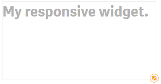
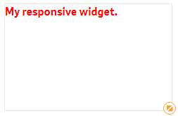

When working with web pages, the most common concept to make web pages responsive is to use [CSS media queries](https://developer.mozilla.org/en-US/docs/Web/CSS/Media_Queries/Using_media_queries). 
Media queries can be used to define different styles for different media types/devices based on the width and height of a device, the orientation, etc.

Media queries is a very useful concept, but in case of widgets (and also visualization extensions) it is not really sufficient respectively does not really help.

Let's review why this is the case:

- Media-Queries allow you to style parts of your web page depending on the current screen size (also called viewport)
- In case of custom objects for Qlik Sense, we have to apply different styles depending on the object size and is therefore defined by the screen size + the amount of columns and cells an object is spanned over in Qlik Sense' grid system.
 
Therefore an additional concept, called element queries has been provided for styling widgets according to its object size. Widget uses a [CSS element queries polyfil](https://github.com/marcj/css-element-queries) to add support for element based media-queries.

## Usage

***Html:***  

```html
<div class="kpi-widget">
	<div class="inner">
	    /* Your Content */
	</div>
</div>
```

***CSS:***  

```css
.kpi-widget .inner {
	/* default style for the inner element */
}

.kpi-widget[max-width~="300px"] .inner {
	/* 	
		default style for the inner element 
		if .kpi-widget has a width of less than 300px 
	*/
}

```

## Example

***Kpi-Widget with less/equal than 300px***  



***Widget with more than 300px***  


```html
<div class="kpi-widget">
	<div class="inner">
		My responsive widget.
	</div>
</div>
```

```css
.kpi-widget .inner {
	font-weight:bold;
	color:darkgray;
	font-size:30px;
}

.kpi-widget[max-width~="300px"] .inner {
	color:red;
	font-size:16px;
}
```


## Reference

The following attributes are supported:

- `min-width`
- `max-width`
- `min-height`
- `max-height`
