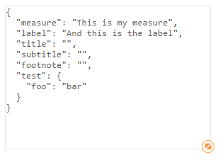

When working with data resp. properties in your widgets, it's quite often useful to get the current state of the AngularJS scope, so that you can validate the output or just to get a better understanding of the underlying data-structure.

### Just Render it ...

The easiest way to get some insights of the internal data-structures is to just render it using pure AngularJS functionality and data binding:

```html
<div class="json" ng-bind="settings | json" />
```
returns the following in the preview area


*The AngularJS filter `json` ([> docs](https://docs.angularjs.org/api/ng/filter/json)) actually converts and object to JSON and therefore allows you to see all properties of the given object.*

This becomes even more useful if you use `pre` for a better readable output:

***Html***

```html
<pre class="json"  ng-bind="settings | json" />
```


***CSS***

```css
.json {
	font-family: monospace;
}
```

***Result***


 

### Using Chrome's DevTools & `qw-console`

*If you are not familiar with Chrome DevTools or development tools available in nearly every browser, then [the official documentation](https://developer.chrome.com/devtools) is a good starting point. 
But basically just press `F12` and you'll see a developer tool appearing in your browser***

There is an experimental component available (as of Qlik Sense 3.0) which allows you to output some information in the developer's console: `<qw-console />`.

Just use it anywhere in the Html area as follows:

***Example:***

```html
<qw-console log="settings" />
```
returns then


## Usage

Log the given object to the console:

```html
<qw-console log="settings" />
```

Log the path property of the given data object

```html
<qw-console log="data.path" />
```

Log the parent scope of the targeted element using a querySelector:

```html
<!-- Using Ids -->
<qw-console log="#objectId" />

<!-- Using classes -->
<qw-console log=".myClass" />
```
